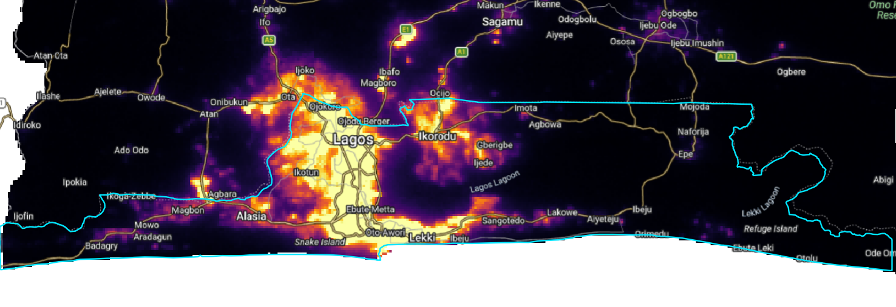
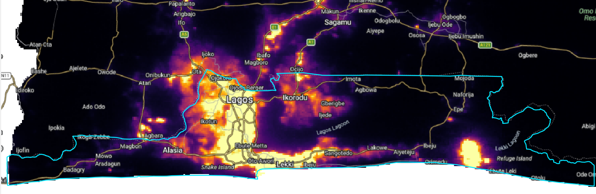
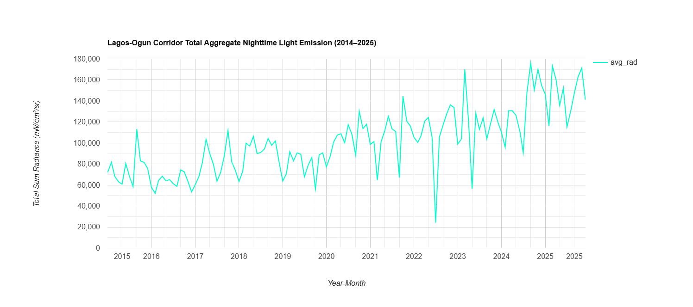

# 🌌 Constrained Growth: Mapping Decadal Urban Encroachment along the Lagos–Ogun Interstate Corridor (2015–2025)


## 📌 Executive Summary

Lagos is Africa’s largest megacity, but its geographic expansion is heavily constrained by the Atlantic Ocean to the south and vast lagoon/wetland systems to the east. As a result, population growth and commercial development have been forced northward, spilling directly across administrative boundaries into neighboring Ogun State.

This project utilizes **Stray-Light Corrected VIIRS Nighttime Light (NTL) composites** to track decadal urban expansion and spatial encroachment across the Lagos–Ogun interstate axis between **2015** and **2025**.

---

## 🗺️ Decadal Radiance Shift (2015 vs. 2025)

<div align="center">
  <table>
    <tr>
      <td align="center"><b>2015 Baseline Radiance</b></td>
      <td align="center"><b>2025 Expanded Radiance</b></td>
    </tr>
    <tr>
      <td width="50%"></td>
      <td width="50%"></td>
    </tr>
  </table>
  <p><i>Figure 1: VIIRS Nighttime Light Radiance across the Lagos–Ogun Corridor (2015 vs 2025). Cyan line denotes the Lagos State administrative boundary.</i></p>
</div>

---

## 🔍 Key Spatial Insights & Findings

### 1. The Northern Express Spine (Lagos–Ibadan Expressway Corridor)
* **2015:** High-intensity radiance ($>15 \text{ nW/cm}^2/\text{sr}$) effectively stopped near the **Ojodu-Berger** state border line, with faint, scattered lighting extending north.
* **2025:** A continuous, highly saturated bright yellow corridor stretches deep past the cyan state boundary, physically linking Lagos to **Magboro, Ibafo, and Mowe** along the E1 highway toward Sagamu.

### 2. The North-Western Industrial Node (Sango Ota Axis)
* A distinct outward expansion occurs along the A5 highway towards **Ota and Ifo**. Industrial growth and residential spillover in Ogun State have fused with the northern Lagos suburbs of Ojokoro and Ikotun.

### 3. The Eastward Industrial Surge (Lekki / Epe Free Trade Zone)
* **2015:** The eastern coastal strip past Sangotedo and Ibeju was predominantly dark.
* **2025:** A massive, high-radiance node has emerged near **Ibeju-Lekki / Lekki Lagoon**, driven by major industrial megaprojects including the Dangote Refinery, Fertilizer Complex, and Lekki Deep Sea Port.

### 4. Coastal Data Refinement (Badagry Axis)
* Observed radiance shifts along the far western coast (Badagry) reflect the impact of **Stray-Light Correction algorithms** in modern NOAA processing, filtering out background coastal noise and returning a truer baseline of lit human settlements.

---

## 📈 Quantitative Time Series Analysis (2014–2025)

<div align="center">
  
  <p><i>Figure 2: Total Aggregate Nighttime Light Emission (Sum Radiance) across the Lagos–Ogun Corridor (2014–2025). Data derived from monthly NOAA/VIIRS DNB composites.</i></p>
</div>

### Key Macro Trends:
* **~130% Increase in Total Radiance:** Total sum radiance grew from a baseline range of **~60,000–80,000 nW/cm²/sr** in 2014/2015 to peaks exceeding **175,000 nW/cm²/sr** by 2025.
* **Post-2020 Growth Acceleration:** The slope steepens noticeably from 2021 onward, reflecting rapid industrial development along the Lekki axis and intense suburban expansion along the northern border into Ogun State.
* **Atmospheric & Seasonal Drivers:** The sharp downward dips (e.g., mid-2022) align with heavy seasonal cloud attenuation during the peak West African monsoon season, validating the necessity of using multi-month median compositing for spatial change detection.

---

## 🛠️ Data & Methodology

* **Data Acquisition:** Monthly Stray-Light Corrected VIIRS Day/Night Band (DNB) imagery (`NOAA/VIIRS/DNB/MONTHLY_V1/VCMSLCFG`) was processed using **Google Earth Engine (GEE)**.
* **Compositing:** Annual median composites were generated for **2015** and **2025** to eliminate transient light spikes and seasonal cloud cover.
* **Cartographic Styling:** Processed in **QGIS** using a continuous `Magma` pseudocolor ramp ($0.5–35.0 \text{ nW/cm}^2/\text{sr}$) overlaid with administrative boundaries and OpenStreetMap transport corridors.

---

## 📁 Repository Structure

```text
├── scripts/
│   └── gee_data_extraction.js             # GEE script for VIIRS collection filtering & export
├── figures/
│   ├── lagos2015.jpg                      # High-res 2015 NTL radiance map
│   ├── lagos2025.jpg                      # High-res 2025 NTL radiance map
│   └── Lagos_Ogun Time series Chart.png   # Decadal aggregate radiance chart
└── README.md                              # Project documentation
